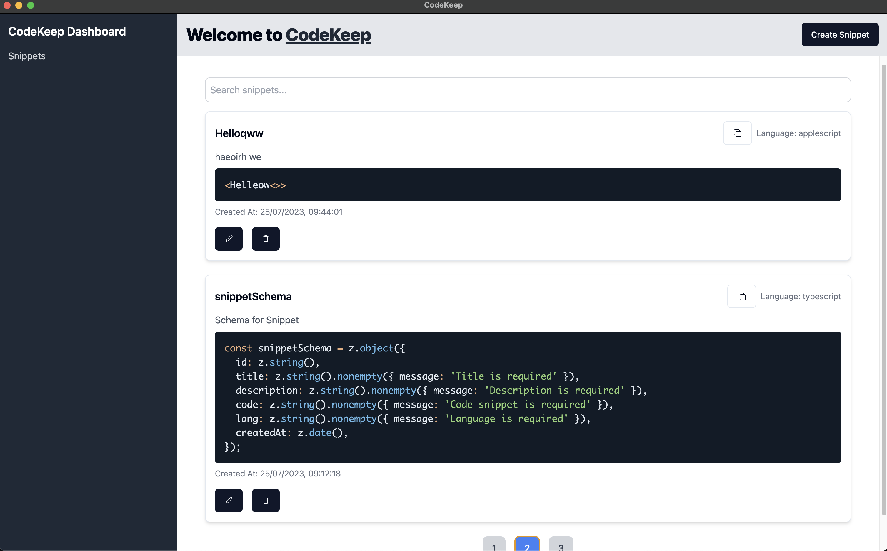
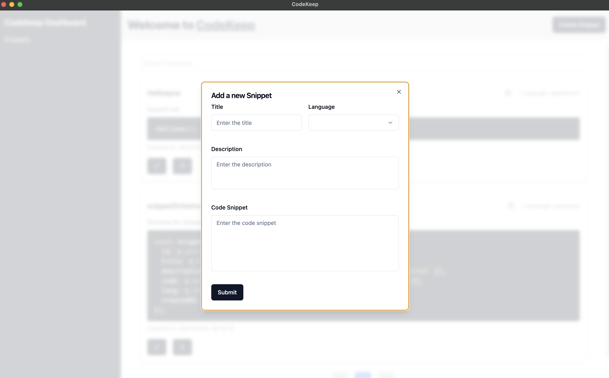
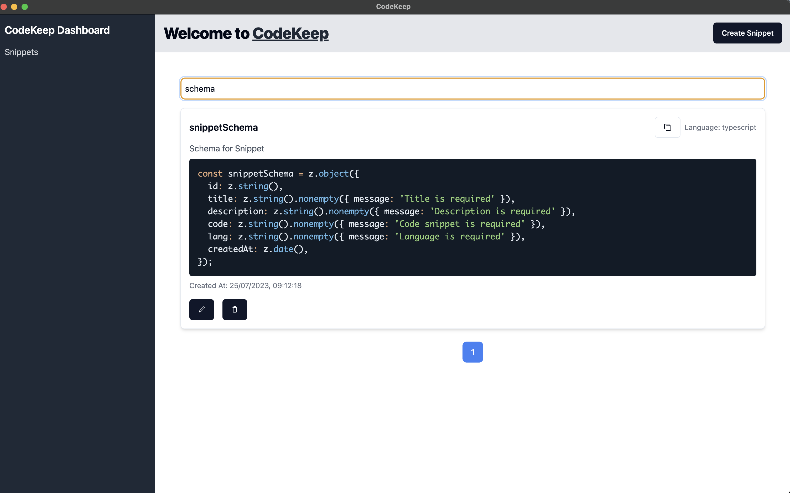

# Code-Keep - README :tada:

## Overview :clipboard:

The Code-Keep project is a desktop application built using Electron, React, TypeScript, and Tailwind CSS. It empowers developers to manage their code snippets efficiently by offering features like creating, viewing, editing, and deleting snippets, organized by language. The app utilizes [Zustand](https://github.com/pmndrs/zustand) for state management and leverages [Radix-UI](https://radix-ui.com/) for various UI components like dialogs, buttons, and toasts. Additionally, it uses [Electron-Store](https://github.com/sindresorhus/electron-store) for local data storage, ensuring persistent data even after closing the application.

## Features :rocket:

- Create, view, edit, and delete code snippets with ease.
- Search and paginate through the snippets with ease.
- Syntax Highlighting: Enjoy visually appealing and developer-friendly code snippets with syntax highlighting based on the programming language.
- Copy code snippets to the clipboard in a single click.

## Design Decisions :bulb:

- **Electron**: Electron is the foundation of the Code-Keep desktop application, providing a cross-platform desktop experience for developers.

- **React and TypeScript**: Utilizing React with TypeScript brings the power of static typing to the application, ensuring a robust and reliable codebase.

- **Tailwind CSS**: Tailwind CSS simplifies styling and responsiveness, allowing for quick design iterations.

- **Radix-UI**: Radix-UI components provide accessible and customizable UI primitives, enhancing the overall user experience.

- **Electron-Store**: Electron-Store is used for local data storage, ensuring that code snippets are securely stored and retained even after closing the application.

## Approach :hammer_and_wrench:

1. **Component Implementation**: Individual React components were developed for UI elements, ensuring modular and reusable code.

2. **Code Highlighting**: We integrated [react-syntax-highlighter](https://github.com/react-syntax-highlighter/react-syntax-highlighter) to enhance the display of code snippets with syntax highlighting based on the programming language.

3. **State Management**: Zustand was chosen for state management, offering a simple and efficient solution for CRUD operations.

4. **Validation**: We implemented form validation using `zod` and `react-hook-form` to ensure data integrity.

5. **Styling**: Tailwind CSS brought the UI to life with a cohesive and visually appealing design.

6. **Testing**: Manual testing was conducted on different devices and browsers for thorough validation.

## Challenges and Solutions :bar_chart:

- **State Management**: Zustand effectively handled state management, enabling seamless data handling across forms and dialogs.

- **Styling Complexity**: Tailwind CSS complexity was managed with a utility-first approach, keeping styles organized and consistent.

- **Form Validation**: `zod` facilitated form validation, ensuring accuracy and user-friendly error handling.

- **Electron Integration**: Integrating Electron-Store for data storage required careful consideration of data synchronization between the main and renderer processes.

## Future Improvements :bulb:

- **User Authentication**: Implementing user authentication would enable secure data management for individual users.

- **Persistent Data Storage**: Storing data in databases or cloud solutions would enable users to access snippets across devices.

- **Sorting and Filtering**: Adding sorting and filtering options would enhance snippet management.

- **Unit Testing**: Writing unit tests with `jest` and `react-testing-library` would ensure application robustness.

## Conclusion :checkered_flag:

Code-Keep simplifies code snippet management and showcases React, TypeScript, Tailwind CSS, and Electron's capabilities. With future enhancements, it will be an invaluable tool for developers to organize and share their code snippets. The app's scalability and maintainability make it a strong foundation for future improvements.

## Additional Points :sparkles:

- **Prettier**: Prettier can be integrated for consistent and formatted code snippets.

- **Synchronizing Data**: Data synchronization between Electron-Store and Zustand was successfully managed.

- **TypeScript for Strongly-Typed Interactions**: TypeScript ensured type safety for interactions between main and renderer processes.

- **Other Features**: The app includes Search and Pagination features for a smoother user experience.

- **Folder Structure**: Future improvements can involve organizing components based on resource types.

- **Loaders**: Adding loaders would provide visual feedback during data operations.

- **Controlled Dialogs**: Migrating to controlled dialogs would offer better control and user experience.

## Get Started

To explore CodeKeep and leverage its powerful features, follow these simple steps:

1. Clone the repository: `git clone https://github.com/imrans110/code-keep.git`
2. Install dependencies: `npm install`
3. Run the application: `npm start`

Thank you for your time! Feel free to explore Code-Keep and discover the joys of efficient code snippet management! :computer: :rocket:

## Screenshots

